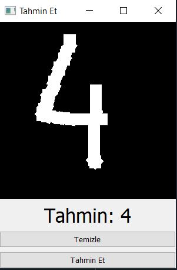
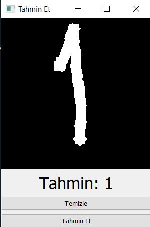
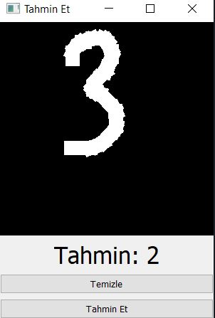

# CizilenSayiTahmin
Yapay zeka ile ekrana çizilen sayıyı tahmin etme
 
İlk önce mnist veri kümesini ilk çıkan linkten indiriyoruz(Bu veri kümesi el yazısıyla yazılmış rakamları içerir)
 
Daha sonra mnist_extractor.py ı çalıştırıyoruz Bu işlem sonucunda svm_model.pkl elde ediyoruz 
 
Daha sonra sırasıyla mnis_trainer.py ve test.py ı çalıştırıyoruz.
 
Ekran çıktıları  
 
 
 
